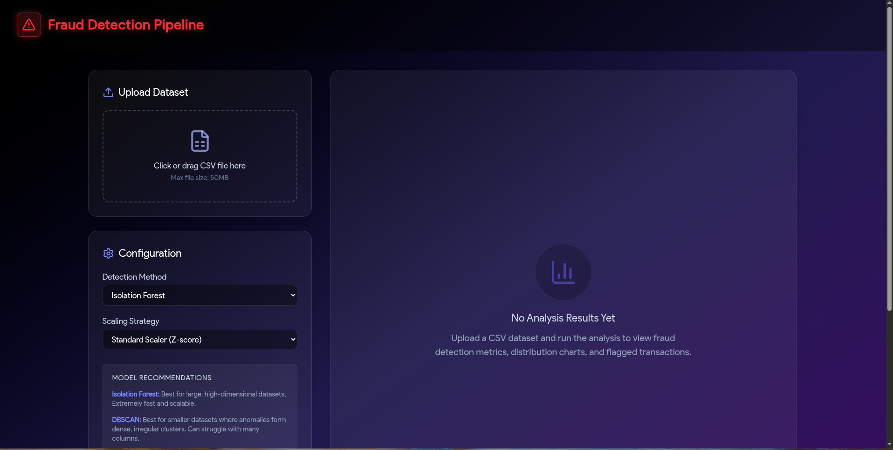
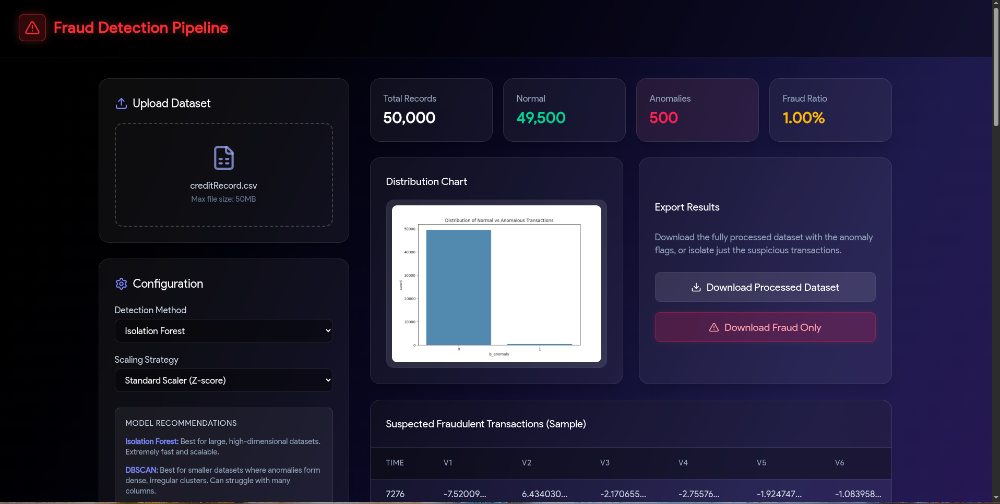
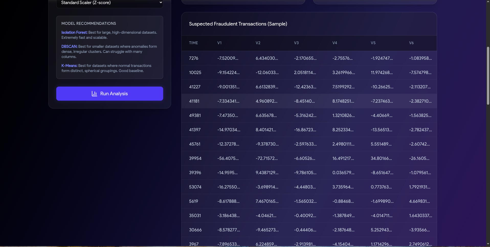
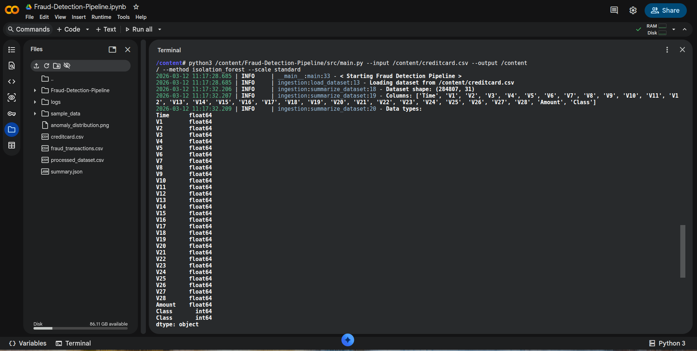
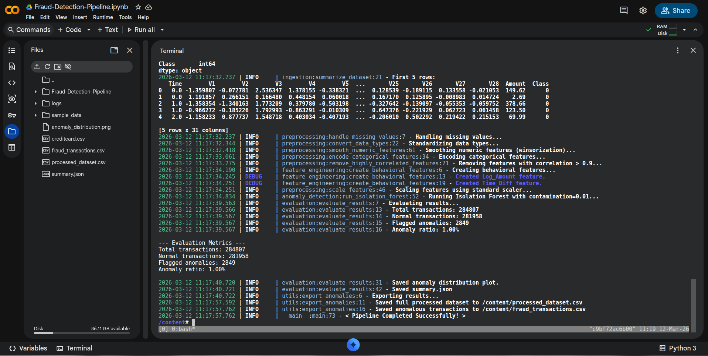

# Fraud Detection Pipeline

A full-stack web application designed to identify, analyze, and visualize anomalous (potentially fraudulent) transactions in datasets using machine learning clustering algorithms.

### 🌐 See in Action
Click the button below:

[](https://fraud-detection-pipeline-i0yp.onrender.com)

A full-stack web application designed to identify anomalous transactions using ML.

## 🎯 Objective
The primary objective is to provide an **automated, no-code Machine Learning pipeline** that identifies fraudulent or anomalous transactions in raw tabular data. Instead of requiring a data scientist to manually clean data, write scripts, and train models, this application automates the entire lifecycle—from data ingestion and preprocessing to model execution and result visualization—accessible through a simple web interface.

## 📸 Application Preview

### Web Interface

<p align="center">
  
  
</p>

<p align="center">
  
</p>

### Command Line Interface

<p align="center">
  
  
</p>

## 💡 What It Shows

* **Full-Stack Architecture:** Connecting a modern React frontend to a Node.js backend that dynamically spawns and manages Python child processes.
* **Applied Unsupervised Learning:** Implementing algorithms like **Isolation Forest**, **DBSCAN**, and **K-Means** to tackle real-world constraints where fraud datasets lack labels.
* **Automated Data Engineering:** Automatically handling missing values, scaling numeric data, encoding categorical text, and dropping highly correlated features.
* **Performance & Scalability:** Utilizing efficient algorithms like Isolation Forest to process massive datasets (e.g., 284,000+ rows) quickly without memory crashes.

## 🚀 Why Use It?
* **Risk & Compliance Teams (Non-Technical Users):** Upload a daily CSV of transactions and instantly get a downloadable list of the top 1% most suspicious transactions to manually investigate, without writing any code.
* **Data Scientists (Rapid Prototyping):** Get a "baseline" understanding of anomalies and data distribution in seconds before spending weeks building complex supervised models.
* **Small Businesses:** Periodically audit payment logs for suspicious activity, chargeback risks, or system glitches without needing a dedicated data science team.

## 📊 How Analysts Can Use the Output
When an analyst downloads the processed CSV (containing normalized features and the `is_anomaly` flag), they can:
* **Triage and Manual Review:** Filter for `is_anomaly == 1` to focus 100% of their investigation time on the most suspicious events.
* **Understand "Why" via Normalized Scores:** Easily interpret the severity of an anomaly (e.g., a value of `4.5` in a standardized `Amount` column means it's 4.5 standard deviations higher than average).
* **Create Hardcoded Business Rules:** Identify trends among anomalies (e.g., specific merchant categories at certain times) to write rules in their payment gateway that automatically block future occurrences.
* **Bootstrap Supervised Learning:** Manually verify the flagged anomalies to create a labeled dataset, which can then be used to train highly accurate supervised models (like XGBoost).

## 📁 Optimal Input Data Structure
For the pipeline to perform at its absolute best, the input CSV should follow this structure (similar to the Kaggle Credit Card Fraud dataset):
* **Row-Level Granularity:** Every single row must represent a single, distinct action (e.g., one credit card swipe, one login attempt). Do not aggregate data.
* **A Unique Identifier:** A column like `Transaction_ID` or `User_ID` so analysts can trace the anomaly back to their database.
* **Rich Numerical Features:** Continuous variables such as `Transaction_Amount`, `Time_Since_Last_Transaction`, or `Distance_From_Home`.
* **Clean Categorical Features:** Standardized text columns like `Merchant_Category` or `Country_Code`.
* **Temporal Data:** A column representing time (like `Hour_of_Day` or `Seconds_Since_Start`).
* **No "Leaky" Variables:** Do not include columns that give away the answer if running in production.

## ✨ Features

* **Interactive Data Upload**: Easily upload your transaction datasets (CSV format, up to 50MB) via a drag-and-drop interface.
* **Configurable ML Models**: Choose between different unsupervised machine learning algorithms to detect anomalies:
  * **Isolation Forest**
  * **DBSCAN**
  * **K-Means Clustering**
* **Data Preprocessing Options**: Select the scaling strategy that best fits your data distribution:
  * **Standard Scaler (Z-score)**: Centers the data around a mean of 0 with a standard deviation of 1.
  * **Min-Max Scaler**: Scales all features to a fixed range, typically 0 to 1.
* **Real-time Analytics Dashboard**:
  * **Key Metrics**: Instantly view Total Records, Normal Transactions, Flagged Anomalies, and the overall Fraud Ratio.
  * **Visualizations**: View dynamically generated distribution charts showing how anomalies are scattered across your data.
  * **Data Preview**: Inspect a sample table of the suspected fraudulent transactions directly in the browser.
* **Export Capabilities**: 
  * Download the fully processed dataset (including the new anomaly flags).
  * Download an isolated dataset containing *only* the flagged fraudulent transactions for focused investigation.

## 🛠️ Tech Stack

* **Frontend**: React 18, Tailwind CSS (Dark Glassmorphism Theme), Lucide React (Icons), Vite
* **Backend**: Node.js, Express, Multer (File handling)
* **Machine Learning / Data Science**: Python 3, Pandas, NumPy, Scikit-learn, Matplotlib, Seaborn

## 🧭 How to Navigate & Use the App

1. **Upload your Dataset**: 
   * Locate the "Upload Dataset" card on the left side of the screen.
   * Click the dashed box to open your file browser, or drag and drop a `.csv` file directly into the box.
2. **Configure the Pipeline**:
   * In the "Configuration" card, select your preferred **Detection Method** and **Scaling Strategy**.
   * **Model Recommendations:**
     * **Isolation Forest**: Best for large, high-dimensional datasets. It is extremely fast and scalable. Ideal for production environments where speed is critical.
     * **DBSCAN**: Best for smaller datasets where anomalies are dense clusters of irregular shapes. Note: Can struggle with very high-dimensional data due to the "curse of dimensionality".
     * **K-Means Clustering**: Best for datasets where normal transactions form distinct, spherical groupings. Good for general-purpose baseline testing.
3. **Run Analysis**:
   * Click the **"Run Analysis"** button. The backend will securely process your data through the Python machine learning pipeline.
4. **Review the Results**:
   * **Metrics**: Check the top row of cards to see the total number of records processed and how many were flagged as anomalies.
   * **Distribution Chart**: Analyze the generated plot to visually understand the separation between normal and anomalous data points.
   * **Data Table**: Scroll down to view the raw data of the flagged transactions to verify the results.
5. **Export**:
   * Use the "Export Results" card to download either the complete processed dataset or just the isolated fraud records.

## 💻 Command Line Interface (CLI) Usage

You can also run the fraud detection pipeline directly from your terminal without using the web interface.

### Prerequisites
Ensure you have Python 3 installed along with the required dependencies:
```bash
pip install pandas numpy scikit-learn matplotlib seaborn loguru
```

### Running the Pipeline
Use the `src/main.py` script to process your dataset:

```bash
python3 src/main.py --input path/to/your/dataset.csv --output path/to/output_dir --method isolation_forest --scale standard
```

### Arguments
* `--input`: (Required) Path to the input CSV file containing transaction data.
* `--output`: (Required) Directory where the results (CSV files, JSON summary, and plots) will be saved.
* `--method`: The clustering algorithm to use. Options: `isolation_forest` (default), `dbscan`, or `kmeans`.
* `--scale`: The scaling strategy to apply. Options: `standard` (default) or `minmax`.

## 👨‍💻 Author

**Nirupam Das**
* **Institution**: Indian Institute of Engineering Science and Technology, Shibpur
